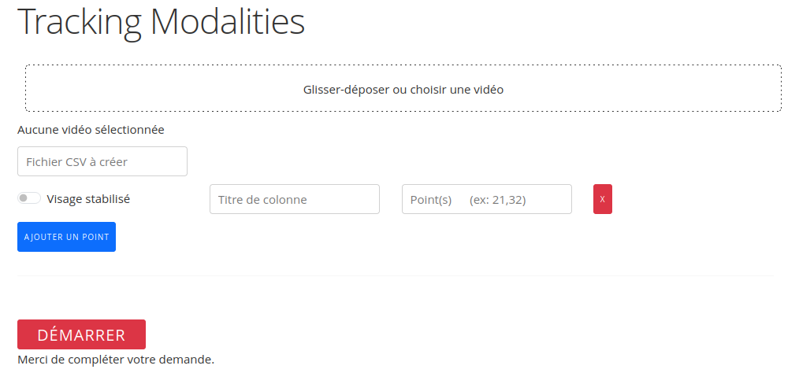

# Face_points_tracker

VideoTrackingDashApp is an interactive Dash application designed for tracking and analyzing facial points in videos, recording the data into a CSV file. This tool utilizes computer vision to allow users to select specific points of interest on the face and measure distances, angles, and areas over time as they appear in the video.

## Application Interface

## Installation

Before running this application, you need to install the required Python libraries. You can install them using the following command:

`pip install dash dash-bootstrap-components numpy opencv-python-headless mediapipe`

Please note that opencv-python-headless is used instead of opencv-python to reduce unnecessary GUI dependencies for server environments.
Usage

1. Clone this repository to your local machine or download the script directly.

2. Navigate to the directory containing the script.

3. Run the script using Python:

`python face_points_tracker.py`

4. Open a web browser and go to http://127.0.0.1:8050/ (or the address indicated in your terminal).

### Follow the steps in the web application:
1. Upload a video file by dragging and dropping or clicking to select.
2. Add tracking points by specifying their labels and corresponding facial landmarks IDs.
3. Enter a name for the CSV file where the tracking data will be saved.
4. Click 'Start Tracking' to process the video and generate the CSV file.

Once the tracking is complete, you can find the CSV file with the tracking data in your specified path.

## Customizing Tracking Points

You can **add** a tracking point by clicking on 'Add a Point'.
For each tracking point:
* Use a single point to track a specific position on the face.
* Use two points to measure the distance between two positions on the face.
* Use three points to calculate the angle formed by these three positions on the face.
* Use four points to calculate the area enclosed by these four positions on the face.

**Remove** any tracking point by clicking the 'X' button next to it.

## Notes

Ensure your video files are not too large to prevent browser crashes or slowdowns.
The accuracy of tracking depends on the quality of the video and the clarity of the facial features.

## Contributing

Feel free to fork this project and submit pull requests for additional features or improvements.
License

This project is licensed under the MIT License - see the LICENSE file for details.
